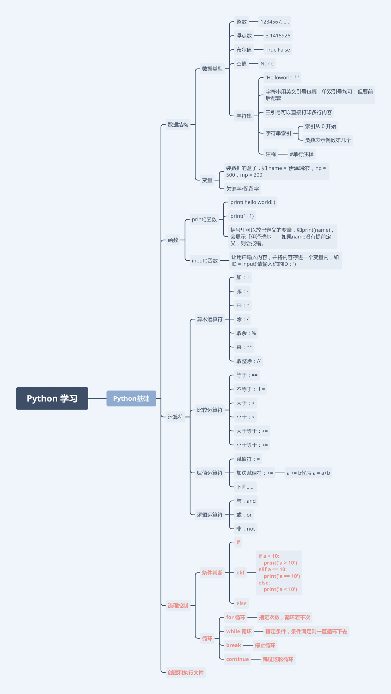

# Python

### 一. 函数：
##### 1. `print()`----- 多行打印，3个单引号。
```python
print('''
        我去买几个橘子，
        你站在此地不要动
    ''');
```
```python
>>> 's' * 10
'ssssssssss'
>>> print("*" * 10)
**********
>>> print("#" * 20)
####################
>>> print("--" * 20)
----------------------------------------
>>> print("-" * 40)
----------------------------------------
```
```python
#不换行，用空格替换换行
print("{:5d}".format(i * n), end=' ')
```
##### 2. `input()`----- 让用户输入某个内容并接收它
```python
    age = inpur('My age is:');
```

##### 3. `format()`  
        - 第一种：占位符 ---  
```python
    print('你叫{}，今年{}岁了'.format(name,age));
```
        - 第二种：数字格式化 ---  
            - {:.0f}   不带小数
   			- {:.2f}   2位小数
            - {:.3f}   3位小数
##### 4. `divmod(num1,num2)`  
   - 第一个值为num1和num2相除得到的值；
   - 第二个值为num1和num2求余得到的值；

##### 5. `range()` ---- 一个数值序列，它生成一个等差数列（并不是列表）
```python
>>> for i in range(5):
...     print(i)
...
0
1
2
3
4
>>> range(1, 5)
range(1, 5)
>>> list(range(1, 5))
[1, 2, 3, 4]
```

### 二. 列表
##### 1.取值
```python
>>> a = [ 1, 342, 223, 'India', 'Fedora']
>>> a
[1, 342, 223, 'India', 'Fedora']

# a[0:5] 用数学表达式可以写为 [0,5) 
>>> a[0:-1]
[1, 342, 223, 'India']
>>> a[2:-2]
[223]
>>> a[:-2]
[1, 342, 223]
```

```python
 +---+-----+-----+---------+----------+
 | 1 | 342 | 223 | 'India' | 'Fedora' |
 +---+-----+-----+---------+----------+
   0    1     2       3        4          5
  -5   -4    -3      -2       -1
```
##### 2. 赋值
```python
>>> letters = ['a', 'b', 'c', 'd', 'e', 'f', 'g']
>>> letters
['a', 'b', 'c', 'd', 'e', 'f', 'g']
>>> # 替换某些值
>>> letters[2:5] = ['C', 'D', 'E']
>>> letters
['a', 'b', 'C', 'D', 'E', 'f', 'g']
>>> # 现在移除他们
>>> letters[2:5] = []
>>> letters
['a', 'b', 'f', 'g']
>>> # 通过替换所有元素为空列表来清空这个列表
>>> letters[:] = []
>>> letters
[]
```
##### 3. 列表长度
```python
>>> len(a)
3
```
4. 

### 三. 循环：
##### 1. `while` -- 非零值为真
    ```
        >>> n = 0
        >>> while n < 11:
        ...     print(n)
        ...     n += 1
        ...
    ```
##### 2. `for x in arr`
```python
>>> a = ['ShiYanLou', 'is', 'powerful']
>>> for x in a:
...     print(x)
...
ShiYanLou
is
powerful
```
##### 3. `else`---它将会在循环完毕后执行，除非有 break 语句终止了循环
```python
>>> for i in range(0, 5):
...     print(i)
... else:
...     print("Bye bye")
...
0
1
2
3
4
Bye bye
```

### 三. 数据类型：
int，float，字符串，布尔，None，列表，元组，字典，集合等。

### 四.  运算符：
##### 1. 逻辑运算符：
   1. 与、或、非 --- and/or/not  
   ```python
      #其中not具有最高运算级别，and次之，or最低
      A and not B or C === (A and (not B))or C
    ```

注意：
1. 任意一个操作是浮点数，结果就是浮点数；
2. 除法结果除不尽时，结果将会是小数。
