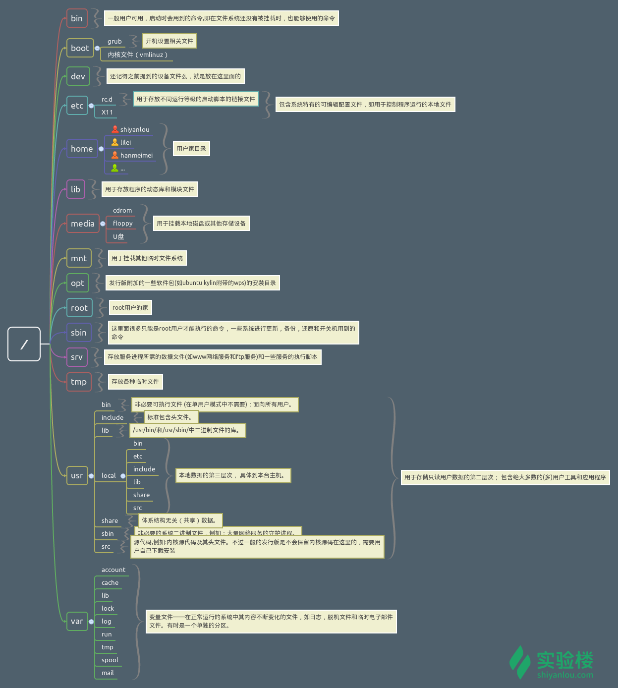

# Linux

## 一. Linux目录说明：



## 二. Linux常用命令：
1. 目录
   1. 查看目录：`ls`
   2. 进入目录：`cd`
   3. 快捷操作：
      1. 向上：`cd..`
      2. 后退：`cd-`
      3. 回到home：`cd~`
      4. 回到根目录：`cd/`
   4. 查看目录结构： `tree`
   5. 新建目录：`mkdir`
      1. 多级目录：`mkdir -p one/two/three`
   6. 复制：`cp -r 原目录 目标目录`
   7. 删除：`rm -r`
2. 文件：
   1. 新建：`touch`
   2. 复制：`cp 文件名 目的路径`
   3. 删除：`rm 文件名`
   4. 移动/重命名：`mv 文件名`
   5. 查看：`cat`
   6. 编辑：
      1. `vim`
      2. `sublime/gedit`
      3. 其他
3. 后续
   。。。


## 三. Git操作：
1. 基本操作：
   1. `git init`
   2. `git config --global user.name  用户名`
   3. `git config --global user.email 邮箱`
2. 提交代码流程：
   1. `git add .`
   2. `git commit -m 'first commit'`
3. 链接远端仓库：
   1. `git remote add origin url`
   2. `git pull`
   3. `git push`
4. 其他`git`命令：
   1. `git remote -v` 查询远程仓库地址
   2. `git branch -a` #查看所有分支
   3. `git branch -r` #查看远程分支
   4. `git branch -vv` #查看本地分支所关联的远程分支
   5. `git branch -m old_branch new_branch` # Rename branch locally
   6. `git push origin :old_branch` # Delete the old branch 
   7. `git push --set-upstream origin new_branch` 或者`git push -u origin new_branch`# Push the new branch, set local branch to track the new remote
5. Git链接不上：
   1. 查询可以用的IP
      ip通过在https://www.ipaddress.com/上分别搜索
      ```
         github.com -> 140.82.114.3
         github.global.ssl.fastly.net -> 199.232.69.194
      ```
   2. 更改host文件
      ```
      #mac host地址：/etc/hosts
      #sudo vim host
      WINDOWS host地址： C:\Windows\System32\Drivers\etc\hosts
      140.82.114.3 github.com 
      199.232.69.194 github.global.ssl.fastly.net
      ```
   3. 激活
      ```
         #大部分情况下是直接生效，如未生效可尝试下面的办法，刷新 DNS：
         Windows：在 CMD 窗口输入：ipconfig /flushdns
         Linux 命令：sudo rcnscd restart
         Mac 命令：sudo killall -HUP mDNSResponder
         Tips： 上述方法无效可以尝试重启机器。
      ```

1. git错误信息：
   ***
   1. ```
         git pull
         There is no tracking information for the current branch. 
         Please specify which branch you want to merge with.
      ```
      对于这种情况有两种解决办法，就比如说要操作master吧，一种是直接指定远程master：  
      `git pull origin master`  
      另外一种方法就是先指定本地master到远程的master，然后再去pull：  
      `git branch --set-upstream-to=origin/master master`  
      `git pull`  
      这样就不会再出现“There is no tracking information for the current branch”这样的提示了。 
      *** 
   2. `refusing to merge unrelated histories`
      该问题在 `merge`，`pull`,`push`中都会出现，在命令后加上`--allow-unrelated-histories`即可。  
      例如：  
      `git pull origin master --allow-unrelated-histories`


## 四. node操作：
### 1. 准备
   1. 查看node版本
   `node -v`
   2. 查看npm版本
   `npm -v`

### 2. 安装
   1. 使用全局，安装`n` 
   `sudo npm i -g n`
   2. 查看`n`是否安装完成
   `n -V`

### 3. 安装与切换node版本
   1. 列出所有node版本 `n ls`
   2. 安装某个版本 `n xx.xx.x (xx.xx.x 为要安装的版本号)`
   3. 安装最新版本 `n lastest`
   4. 安装最新稳定版 `n stable`
   5. 切换node版本(输入命令后上下键盘选择确认) `n`
   6. 删除某个版本 `n rm xx.xx.x`
   7. 使用某个版本来运行脚本 `n use xx.xx.x a.js`